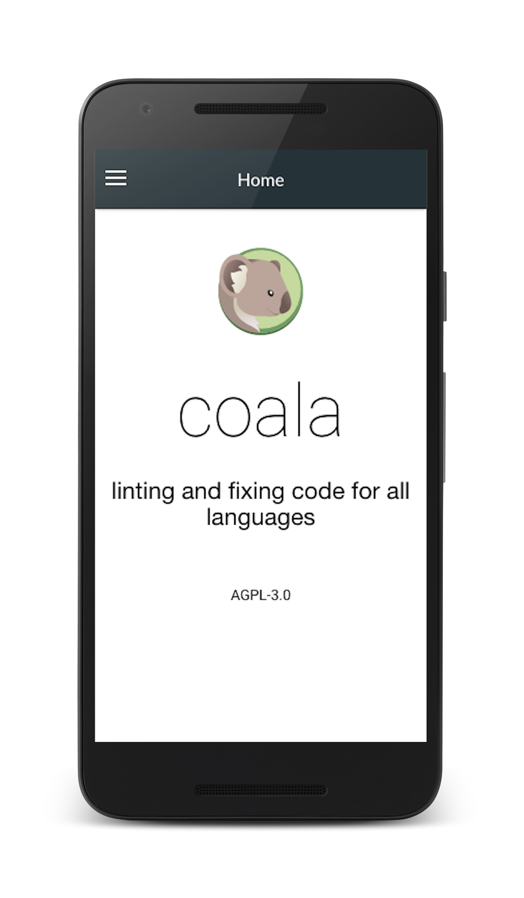
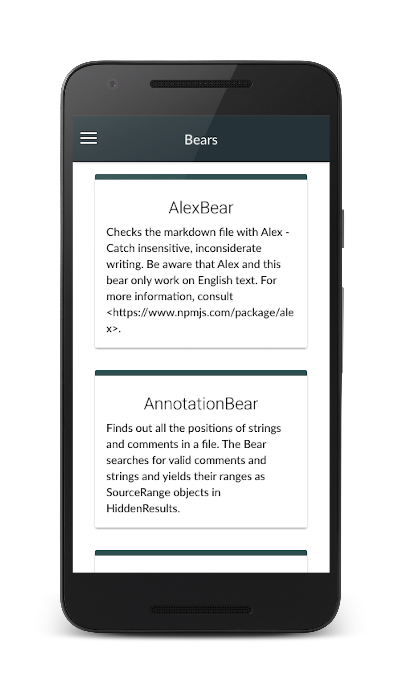

<p align="center"><h1 align="center">try-ionic</h1></p>
<p align="center">Ionic App powered by coala.io webServices</p>

<p align="center">
</p>

#### Running locally
```
$ npm install -g cordova ionic
$ git clone http://github.com/hemangsk/try-ionic.git
$ cd try-ionic
$ ionic serve -p 8080
```

Ionic App is now running on ```localhost:8080``` :tada:

#### Running on Android Device

The app can be run inside IonicView Android Application. The App ID of try-ionic app is ```eec93b9f```.
